::: {.callout-note appearance="simple"}
## Summary
The route from metric centrality to Space Syntax (SS) measures is split into single design
changes, each measured by rank agreement over interior streets, in Copenhagen + Frederiksberg
and the Mumbai island city (OSM walk networks). SS measures were reimplemented and matched to
depthmapX first.

1. Metric closeness and NAIN are nearly unrelated at walking radii (ρ ≈ 0 at 400 m). Normalisation is the largest single step.
2. Choice/betweenness is robust across representations; closeness/integration is not.
3. Junction consolidation matters as much as angular cost.
4. Global measures depend on map extent; position matters more than size.
5. Axial maps generated from OSM do not reproduce hand-drawn ones (ρ ≤ 0.28).
6. Neighbourhoods differ an order of magnitude more than the two cities.
:::

# Question

SS (Hillier & Hanson 1984; Hillier 1996) and street-network analysis (Porta, Crucitti & Latora
2006; Boeing 2017; Simons 2023) both rank streets by centrality but differ in many choices at
once: node definition, cost, normalisation, cleaning, extent. Whole-workflow comparisons cannot
attribute differences to any one of them.

**Which choices separate the two, by how much, and where?** Not which is better; that needs
movement data (§ Limits).

Test beds: **Copenhagen + Frederiksberg** (formal, 23–26 km of walk network per km²) and the
**Mumbai island city** (formal and informal, 14–16 km/km²; OSM omits most informal lanes, so
Mumbai results describe the formal skeleton only).

# Definitions

Notation: nodes \(i, j\); \(d_{ij}\) shortest-path distance under the chosen cost; radius \(r\)
limits each node's catchment \(N_i(r)\) to \(d_{ij} \le r\) (metres for metric and angular,
steps for axial); Rn = no limit.

## Representations

| Term | Definition |
|---|---|
| Junction (primal) graph | nodes = junctions; edges = streets weighted by length |
| Segment (dual) graph | nodes = streets; linked if they share a junction |
| Straight pieces | curved streets split into straight lines (depthmapX segment map; Turner 2007) |
| Axial map | fewest, longest lines covering open space; nodes = lines, links = intersections (Hillier & Hanson 1984) |
| Generated axial map (S4) | natural streets straightened (Douglas–Peucker, 8 m), ends extended 9 m to cross (Liu & Jiang 2012); a line map rather than a fewest-line map |
| Natural street | chain of streets continuing through junctions with deflection ≤ 30°, straightest pairs first |
| Interior / buffer | reported streets (midpoint inside boundary) / 2 km surround for full catchments |

## Cost

| Cost | Definition |
|---|---|
| Metric | network length (m) |
| Angular | sum of turns, 90° = 1; depthmapX bins turns (tulip, 1024 bins) |
| Topological | line changes (axial) |
| Metric radius on angular routes | depthmapX measures R along the least-angle route, midpoint to midpoint; not the metric neighbourhood |

## Measures

| Measure | Definition | Rung |
|---|---|---|
| Node count \(NC\) | \(\lvert N_i(r)\rvert\) | all |
| Total depth \(TD\) | \(\sum_{j} d_{ij}\) | all |
| Harmonic closeness | \(\sum_j 1/d_{ij}\) | S0, S1 |
| NC²/TD ("Hillier") | \(NC^2/TD\); angular integration in depthmapX ≥ 10 | S1–S3 |
| **NAIN** | \(NC^{1.2}/(TD+2)\) (Hillier, Yang & Turner 2012) | S3 |
| Betweenness / choice | routes between other pairs passing through \(i\) (Freeman 1977) | S0–S4 |
| **NACH** | \(\log(CH+1)/\log(TD+3)\) | S3 |
| Mean depth, RA | \(MD = TD/(k-1)\); \(RA = 2(MD-1)/(k-2)\), \(k\) incl. root | S4 |
| D-value | \(D_k = 2\{k[\log_2((k+2)/3)-1]+1\}/[(k-1)(k-2)]\) | S4 |
| Integration HH | \(D_k/RA\); undefined if \(MD \le 1\) (depthmapX −1) | S4 |
| R3 | radius 3 steps, own normaliser | S4 |
| Connectivity | lines intersected | S4 |
| Intelligibility | Pearson \(r\)(connectivity, HH Rn) | S4 |
| Synergy | Pearson \(r\)(HH R3, HH Rn) | S4 |

depthmapX conventions reproduced exactly: per-direction angular choice; random ties in axial
choice; metric-first tie-breaking within a tulip bin.

## Statistics

| | |
|---|---|
| Spearman ρ | rank agreement over interior streets (units and normalisations differ; order is the question) |
| Top-10% overlap | share of one measure's top decile in the other's |
| Percentile difference | per street, percentile under A minus under B; ±10 points = agreement |

## Network cleaning

| Term | Definition |
|---|---|
| Consolidation | merge junctions within a tolerance (OSMnx; 0, 10, 20 m) |
| Stub | straight piece OSMnx appends from a street's old end to the merged junction |
| Destub | remove stubs |
| Parallel merge | keep one street per junction pair within tolerance |
| Baselines | raw `c0` (0 m) and cleaned `c10dp` (10 m, destubbed, merged) |

# Data

| | Copenhagen + Frederiksberg | Mumbai City District |
|---|---|---|
| Area | 103.2 km² | 71.2 km² |
| CRS | EPSG:25832 | EPSG:32643 |
| Interior network, cleaned | 2,373 km; 23.0 km/km² | 1,033 km; 14.5 km/km² |
| Interior streets, raw / cleaned | 64,625 / 31,291 | 16,987 / 10,271 |
| Median street, raw / cleaned | 27 / 62 m | 43 / 73 m |

Copenhagen has 1.57–1.58× Mumbai's network length per km² at every cleaning level; segment-count
ratios (1.5–2.6×) depend on cleaning and are not quoted. Reference map: depthmapX's Barnsbury
test data (1,100 hand-drawn lines). Street data © OpenStreetMap contributors (ODbL).

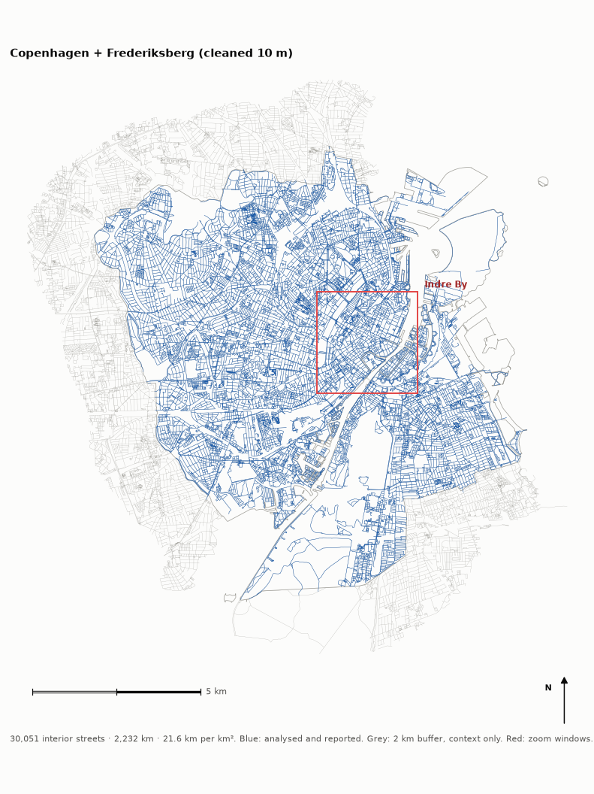
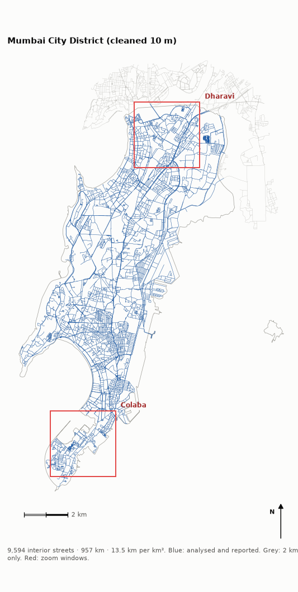

# Method

## Ladder

| Rung | Representation | Cost | Measures | Engine |
|---|---|---|---|---|
| S0 | junction graph | metric | harmonic, betweenness | cityseer |
| S1 | segment graph | metric | harmonic, NC²/TD, betweenness | cityseer |
| S2 | segment graph | angular | NC²/TD, betweenness | cityseer |
| S3 | straight pieces | angular (tulip-1024) | integration, choice, NAIN, NACH | depthmapX |
| S4 | generated axial lines | topological | HH Rn/R3, choice, intelligibility, synergy | depthmapX |

Adjacent rungs differ by one choice. Radii 400, 800, 1200, 2000 m. S0 values: mean of the two
junctions; S3/S4: length-weighted mean over covering pieces or lines.

## Fidelity

Reimplemented from depthmapX source; checked on Barnsbury with identical connection lists:

- Axial depth and integration: match to ~1e-7. Choice: equal totals, ρ 0.996 (depthmapX's random ties; two depthmapX runs agree at 0.995).
- Angular NC, TD, integration: exact at R400–Rn. Choice: exact for 99.1–100% of segments.

Conventions found: [nuance catalogue](nuances.md) (33 entries).

## Work packages

| WP | Question | Design |
|---|---|---|
| Phase 0 | effect of each step, city-wide | S0–S3, both cities, 4 radii; chord control |
| WP1 | uniform across the city? | ρ inside 1 km tiles vs tile density |
| WP2 | effect of cleaning | ladder at 0, 10, 20 m |
| WP2b | why cleaning splits engines | synthetic junction, stub census, destubbing, segment length ÷ radius |
| WP3 | effect of map extent | Dharavi in nested maps vs Greater Mumbai + 2 km |
| WP4 | effect of the axial step | generated axial maps; hand-drawn Barnsbury validation |

# Results

## Ladder (Phase 0)

ρ at 400 / 800 / 1200 / 2000 m, cleaned networks.

| Closeness step | Copenhagen | Mumbai |
|---|---|---|
| junction vs segment | .91 .93 .95 .97 | .88 .92 .95 .97 |
| harmonic vs NC²/TD | .98 .97 .97 .98 | .98 .98 .98 .98 |
| metric vs angular | .75 .76 .78 .83 | .84 .88 .89 .91 |
| cityseer vs depthmapX | .79 .84 .86 .90 | .67 .78 .82 .86 |
| **NC²/TD vs NAIN** | **.53 .64 .69 .74** | **.44 .59 .68 .76** |
| **end to end** | **.07 .21 .29 .42** | **−.03 .20 .33 .47** |

| Betweenness step | Copenhagen | Mumbai |
|---|---|---|
| junction vs segment | .63 .62 .60 .59 | .69 .67 .65 .61 |
| metric vs angular | .79 .75 .74 .75 | .81 .75 .72 .70 |
| cityseer vs depthmapX | .69 .73 .73 .73 | .62 .67 .66 .67 |
| choice vs NACH | .78 .89 .92 .93 | .68 .82 .89 .94 |
| end to end | .57 .63 .64 .65 | .39 .46 .49 .52 |

- No single step explains the gap; effects compound.
- Formula is irrelevant (ρ 0.98); normalisation is the largest step: \(NC^{1.2}\) sets how much catchment density is rewarded.
- Agreement rises with radius.
- Betweenness survives (end to end 0.39–0.65).
- Chords instead of curves raise NC²/TD vs NAIN by 0.08–0.11 and choice vs NACH by 0.04–0.10: curves add pieces to NC and TD.

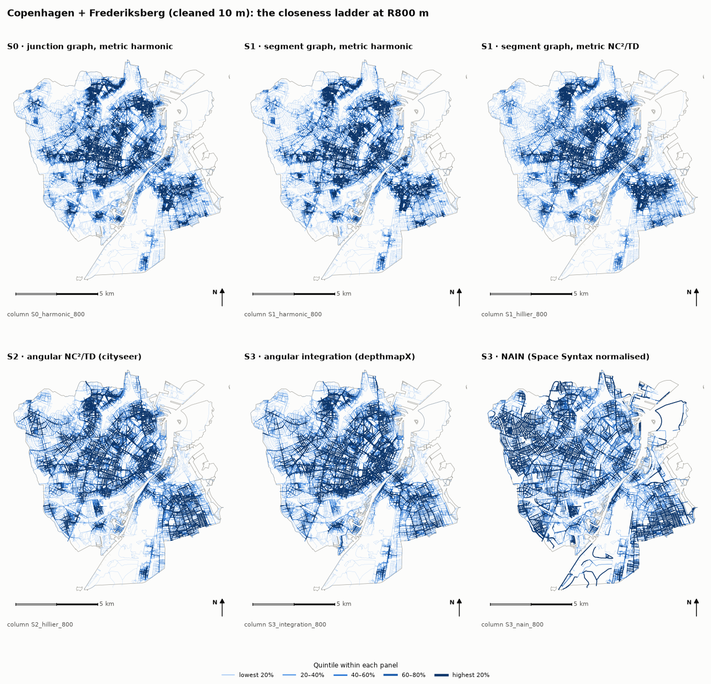
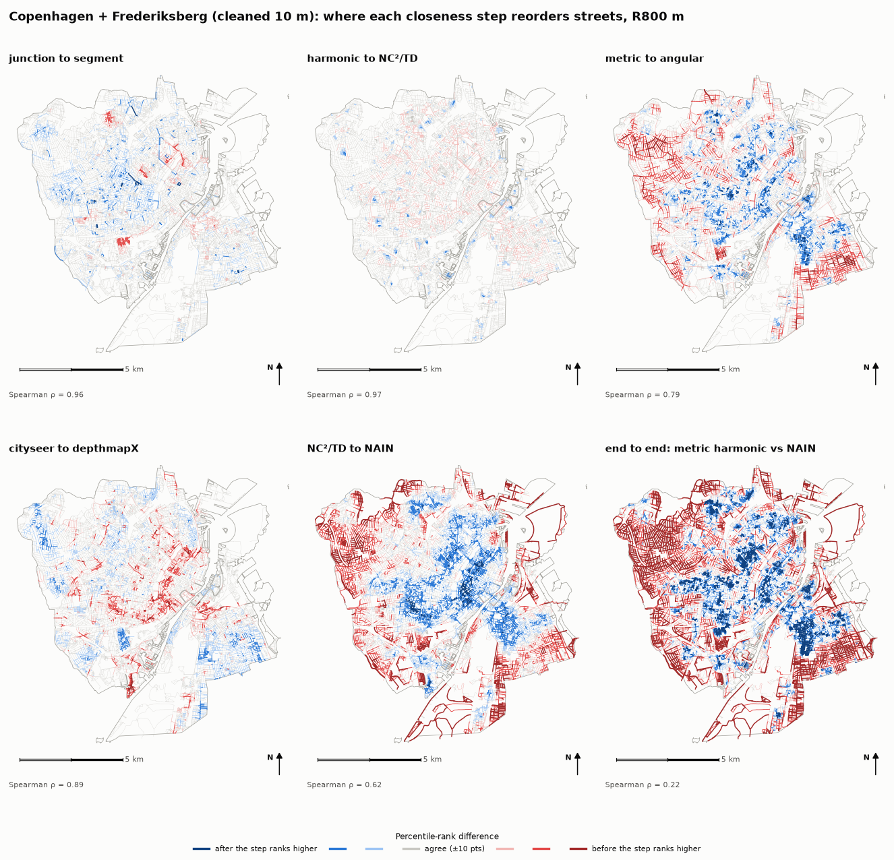
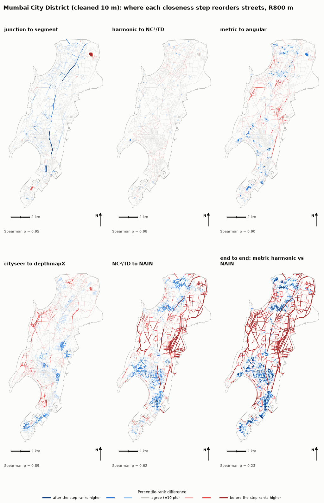

Divergence maps: red, the street ranks higher after the step; blue, lower; grey, within 10
points. End to end, NAIN promotes long continuous streets; metric closeness promotes compact
central clusters. All ladder, radius and step maps: [atlas](atlas/index.md); interactively:
[dashboard](dashboard.qmd).

## Tiles (WP1)

1 km tiles, cleaned networks, R800.

| Step | City | Tiles | p10 | median | p90 | r with density |
|---|---|---|---|---|---|---|
| metric vs angular | Copenhagen | 98 | .58 | .78 | .89 | −.16 |
| | Mumbai | 66 | .62 | .80 | .91 | −.02 |
| NC²/TD vs NAIN | Copenhagen | 98 | .51 | .80 | .90 | .36 |
| | Mumbai | 66 | .40 | .81 | .90 | .12 |
| closeness end to end | Copenhagen | 98 | .00 | .30 | .52 | .24 |
| | Mumbai | 66 | −.12 | .26 | .48 | .18 |
| betweenness end to end | Copenhagen | 98 | .59 | .71 | .79 | .12 |
| | Mumbai | 66 | .47 | .67 | .79 | .35 |

- City medians differ by 0.01–0.04; within-city spread is 0.20–0.60.
- Mumbai has the longer low tail (NAIN p10 .40 vs .51).
- Density explains little (|r| < 0.3 for 6 of 8).
- Inside tiles NC²/TD vs NAIN is 0.80; city-wide 0.59–0.64: NAIN partly re-ranks neighbourhoods against each other.

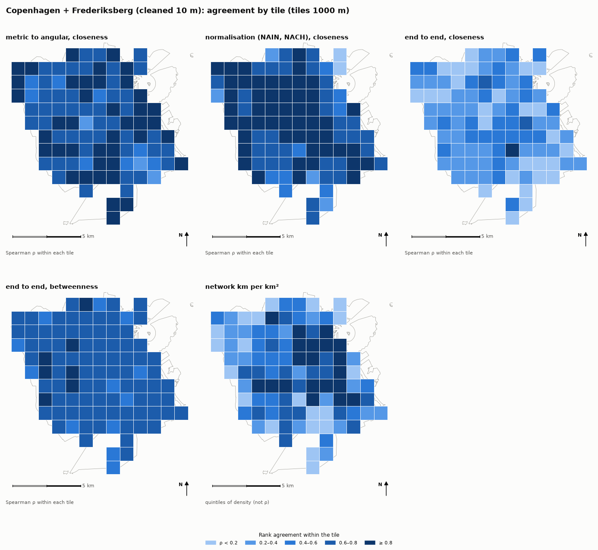
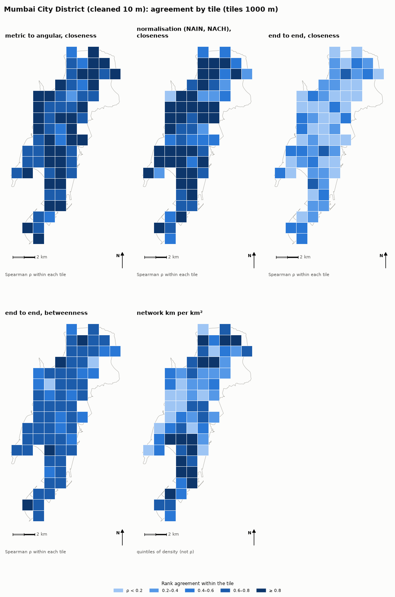

## Indre By, Colaba, Dharavi

3 × 3 km windows, same scale, quintiles within each window; numbers in `atlas/windows.csv`.
Dharavi's network is the formal skeleton only.

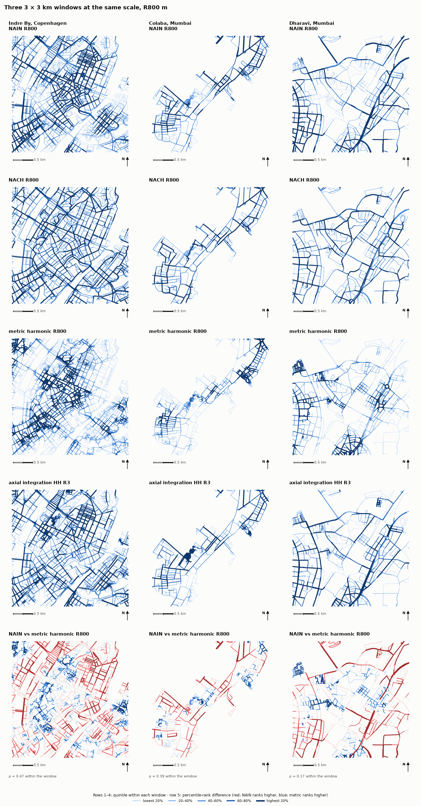

## Cleaning (WP2, WP2b)

- 0 to 20 m consolidation: Copenhagen streets ÷4.2 (64,625 to 15,238), Mumbai ÷2.4; length per km² stable.
- Engine agreement: 0.90–0.99 raw; 0.67–0.90 (closeness) at 10 m; 0.54–0.92 across families at 20 m.
- Mechanism: OSMnx appends **stubs** at merged junctions. cityseer routes along them (angular cost up); depthmapX counts them as pieces (NC up).

| Synthetic dual carriageway | cityseer angular farness | depthmapX pieces / TD |
|---|---|---|
| raw | 13.0 | 7 / 7.0 |
| consolidated 10 m | 17.0 | 12 / 12.0 |
| destubbed | 9.0 | 6 / 4.0 |

- One street end in 4–5 carries a stub at 10 m (19.7% Copenhagen, 25.1% Mumbai).
- Destubbing recovers about half the lost agreement; the rest follows **median segment length ÷ radius** (rank r −0.96, 20 runs): ρ ≈ 0.95 at 0.03, 0.90 at 0.08, 0.80 at 0.18.
- Merging dual carriageways changes nothing.

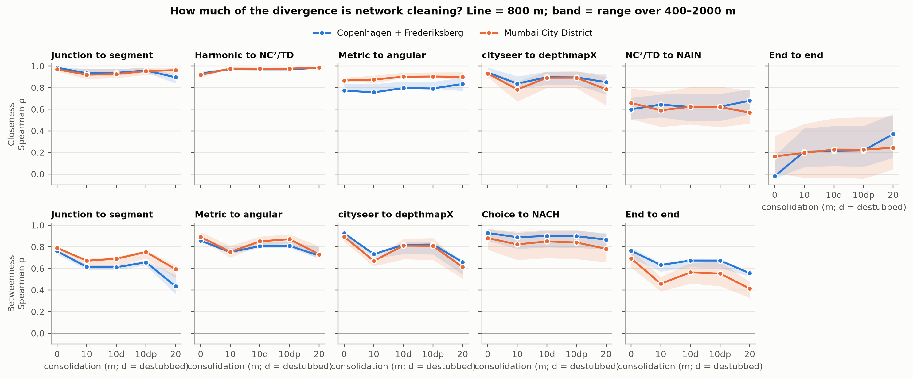
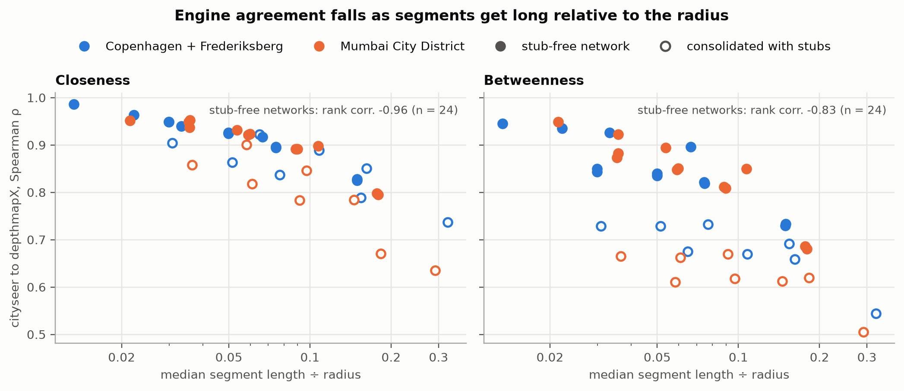
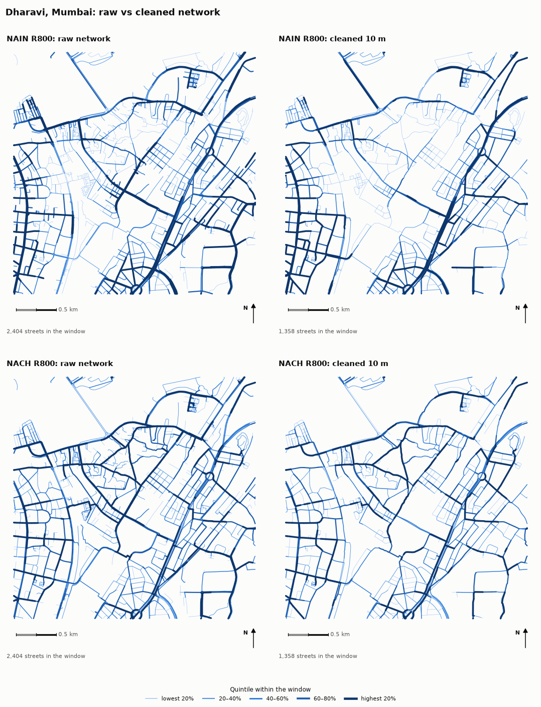

## Extent (WP3)

Dharavi's 278 streets vs Greater Mumbai + 2 km (36,714 streets):

| Map | Streets | NAIN R400 / R800 / R2000 | NAIN Rn | NACH Rn |
|---|---|---|---|---|
| clipped at boundary | 278 | .92 / .79 / .57 | **.53** | .68 |
| + 0.5 km | 692 | 1.00 / 1.00 / .94 | .86 | .91 |
| + 1 km | 1,372 | 1.00 / 1.00 / 1.00 | **.96** | .98 |
| + 2 km | 3,116 | 1.00 / 1.00 / 1.00 | .97 | .99 |
| + 4 km | 7,478 | 1.00 / 1.00 / 1.00 | .99 | .99 |
| G/North ward + 2 km | 5,685 | 1.00 / 1.00 / 1.00 | .95 | .99 |
| island city + 2 km | 12,119 | 1.00 / 1.00 / 1.00 | **.83** | .98 |

- Radius-bounded measures are exact once the surround reaches the radius; 2 km suffices.
- Global NAIN converges with a centred 1 km surround (0.96).
- The island city, 4× larger with Dharavi at its edge, reaches 0.83: position beats size.

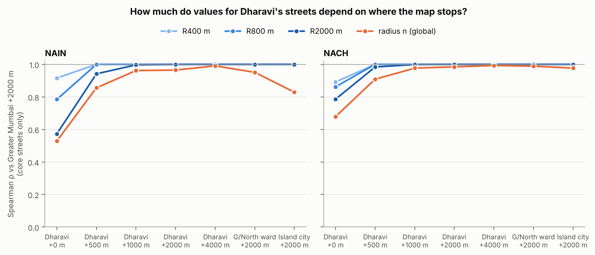

## Axial step (WP4)

### Hand-drawn and generated axial maps

A hand-drawn axial map is the original Space Syntax input (Hillier & Hanson 1984): an analyst draws,
over a plan, the fewest and longest straight lines that pass through every accessible open space.
Each line is one line of sight and movement; measures count line changes.

- Lines follow sight rather than the road centre: across squares, through parks, along one side of a wide street.
- One line can run through several aligned streets.
- "Fewest" is a whole-map criterion, so lines are not cut street by street.
- Drawing involves judgement; two analysts can produce different maps. Algorithmic fewest-line maps
  (Turner, Penn & Hillier 2005) need building outlines or open-space polygons rather than centrelines.

No hand-drawn map exists for Copenhagen or Mumbai, so S4 uses lines generated from OSM centrelines
(natural streets, Douglas–Peucker 8 m, ends extended 9 m). Barnsbury, the hand-drawn map shipped with
depthmapX, tests whether that substitute holds:

| | Hand-drawn | Generated from OSM |
|---|---|---|
| Median line length | 178 m | 40–80 m, about one line per street |
| Position | 10–30 m off centrelines; a third through open space off the street network | on centrelines |
| Hand-drawn line samples within 5 / 15 m of an OSM centreline | 25% / 56% | — |
| Intelligibility r | .54 | .02–.15 (cities), .20–.27 (Barnsbury) |
| Rank agreement with hand-drawn | — | ρ 0.04–0.28, every measure, input and tolerance |

City S4 results are therefore centreline line-map results: a topological analysis of the street
centrelines. This explains why axial choice tracks NACH (below). A like-for-like axial test needs a
hand-drawn sample tile (Project 2, Dharavi).

### Results

| | Lines | Median line | Mean conn. | Intelligibility r | Synergy r |
|---|---|---|---|---|---|
| Copenhagen cleaned / raw | 38,831 / 54,220 | 54 / 40 m | 4.6 / 3.6 | .12 / .10 | .23 / .28 |
| Mumbai cleaned / raw | 10,087 / 13,322 | 79 / 63 m | 4.3 / 3.6 | .02 / .15 | .15 / .33 |
| Copenhagen tol 4 / 16 m | 51,183 / 29,138 | 40 / 72 m | 4.1 / 5.4 | .12 / .13 | .22 / .24 |
| *Barnsbury hand-drawn* | *1,092* | *178 m* | *4.0* | *.54* | *.72* |

(interior lines)

Validation on Barnsbury: fed the hand-drawn lines split into pieces, the generator recovers the
map (ρ 0.95–0.99). Fed OSM, it does not:

| OSM input | km/km² (ref. 14.3) | ref. within 15 / 50 m | lines (tol 8) | intelligibility | best ρ |
|---|---|---|---|---|---|
| walk | 24.2 | .56 / .95 | 5,460 | .20 | .26 |
| streets only | 13.0 | .39 / .84 | 1,782 | .27 | .28 |

- No coordinate offset (shift scan optimum 0, −1 m).
- Hand-drawn lines sit 10–30 m off centrelines; a third follow open space off the street network.
- ρ stays 0.04–0.28 for every measure, input, tolerance and matching radius.

S4 vs angular ladder, interior streets, cleaned (raw):

| | R | HH Rn vs NAIN | HH R3 vs NAIN | HH Rn vs metric harmonic | choice Rn vs NACH |
|---|---|---|---|---|---|
| Copenhagen | 800 | .22 (.26) | .58 (.59) | .40 (.31) | .70 (.78) |
| | 2000 | .40 (.45) | .45 (.45) | .68 (.58) | .73 (.80) |
| Mumbai | 800 | .32 (.33) | .58 (.64) | .00 (.05) | .63 (.72) |
| | 2000 | .30 (.44) | .55 (.61) | .13 (.17) | .70 (.78) |

- Axial choice tracks NACH (0.6–0.8); axial integration does not (0.1–0.45).
- Global axial integration tracks metric closeness in Copenhagen (0.68 at 2 km) and barely in the Mumbai peninsula (0.13): position again.
- Intelligibility is near zero in both cities; cleaning moves it more than the city.
- Tolerance 4 to 16 m: lines −43%, every ladder ρ within 0.05.
- depthmapX drops coincident duplicate lines; the generator now merges them.

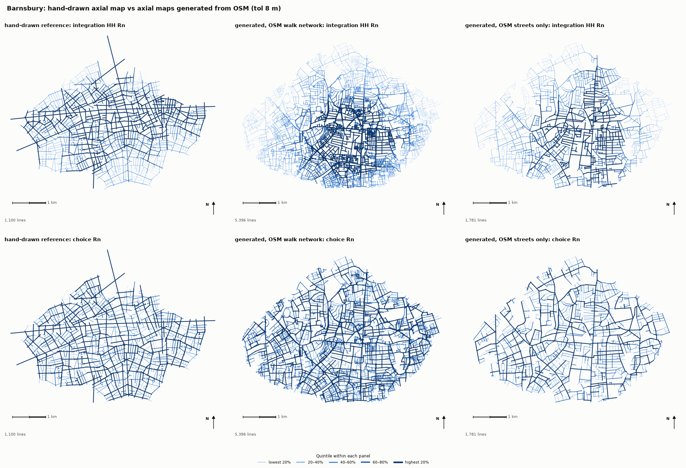
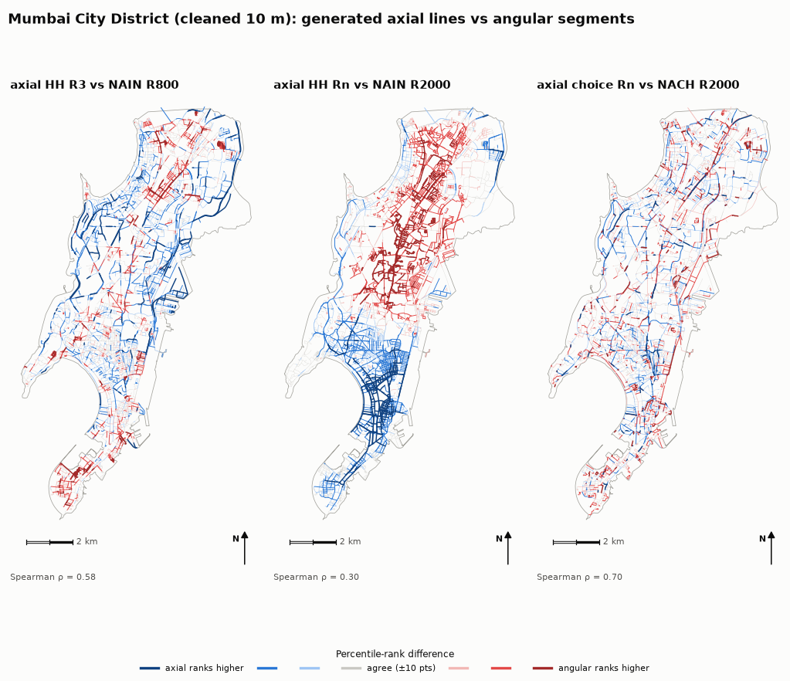

# Implications

**Space Syntax practice**

- NAIN is a modelling decision rather than a rescaling; test integration findings under NC²/TD or harmonic closeness.
- Base findings that must survive representation, engine or cleaning on choice/NACH.
- Report tulip bins, tie-breaking and choice counting.
- Treat generated axial maps as centreline line maps; axial claims need hand-drawn lines.
- Global measures need a ~1 km surround centred on the study area.

**Network analysis practice**

- Destub after consolidation; report tolerance, stub handling and median segment length.
- Compare cities by network km per km² rather than segment counts.
- Report the cityseer radius set (results at one radius depend on the others requested).

**Comparing cities**: compare at matched neighbourhood scale or full distributions; city means hide most variation.

**Informal settlements**: OSM describes the formal skeleton only; measure the informal-lane delta before using either approach. Clipped analyses are unreliable (global NAIN ρ 0.53).

**Exposure studies**: use choice (NACH, or segment betweenness) as the movement proxy; integration inherits normalisation and cleaning sensitivity.

# Reporting checklist

1. Data source, date, walk/drive filter.
2. Consolidation tolerance, stub and parallel handling, median segment length.
3. Representation; how axial lines were made.
4. Cost and radius definition.
5. Measure and normalisation constants.
6. Engine, version, tie-breaking, choice counting.
7. Study area, buffer, map boundary, position of the area in the map.
8. Radius set.
9. Transfer of values to streets.
10. Ranks or raw values; within-city spread when comparing cities.

# Limits

- No movement data: methods compared with each other rather than validated (WP5 Copenhagen counts; Dharavi gate counts in Project 2).
- Mumbai: formal network only.
- One cleaning pipeline (OSMnx), one SS engine (depthmapX), one network engine (cityseer).
- S4 is generated; one hand-drawn reference (London).
- Tile ρ rests on 50 to a few hundred streets.
- Duplicate streets remain in cleaned S0–S3 networks (≈ 0.7% of Mumbai lines).

# Next

WP5 Copenhagen counts · Project 2: Dharavi lanes, informal-lane delta, hand-drawn axial tile,
VGA, gate counts · Project 3: pedestrian-weighted exposure from robust measures.

# References {.unnumbered}

- Boeing, G. (2017). OSMnx. *Computers, Environment and Urban Systems*, 65, 126–139.
- Crucitti, P., Latora, V. & Porta, S. (2006). Centrality measures in spatial networks of urban streets. *Physical Review E*, 73, 036125.
- Freeman, L. C. (1977). A set of measures of centrality based on betweenness. *Sociometry*, 40(1), 35–41.
- Hillier, B. (1996). *Space is the Machine*. Cambridge University Press.
- Hillier, B. & Hanson, J. (1984). *The Social Logic of Space*. Cambridge University Press.
- Hillier, B. & Iida, S. (2005). Network and psychological effects in urban movement. *COSIT 2005*, LNCS 3693, 475–490.
- Hillier, B., Yang, T. & Turner, A. (2012). Normalising least angle choice in Depthmap. *Journal of Space Syntax*, 3(2), 155–193.
- Liu, X. & Jiang, B. (2012). Defining and generating axial lines from street center lines. *IJGIS*, 26(8), 1521–1532.
- Porta, S., Crucitti, P. & Latora, V. (2006). The network analysis of urban streets: a dual approach. *Physica A*, 369(2), 853–866.
- Ratti, C. (2004). Space syntax: some inconsistencies. *Environment and Planning B*, 31(4), 487–499.
- Simons, G. (2023). The cityseer Python package. *EPB: Urban Analytics and City Science*, 50(5), 1328–1344.
- Teklenburg, J., Timmermans, H. & van Wagenberg, A. (1993). Space syntax: standardised integration measures. *Environment and Planning B*, 20(3), 347–357.
- Turner, A. (2007). From axial to road-centre lines. *Environment and Planning B*, 34(3), 539–555.
- Turner, A., Penn, A. & Hillier, B. (2005). An algorithmic definition of the axial map. *Environment and Planning B*, 32(3), 425–444.
- depthmapX, SpaceGroupUCL. <https://github.com/SpaceGroupUCL/depthmapX>
