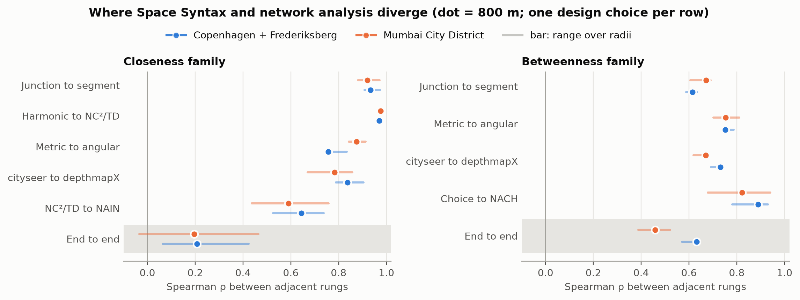
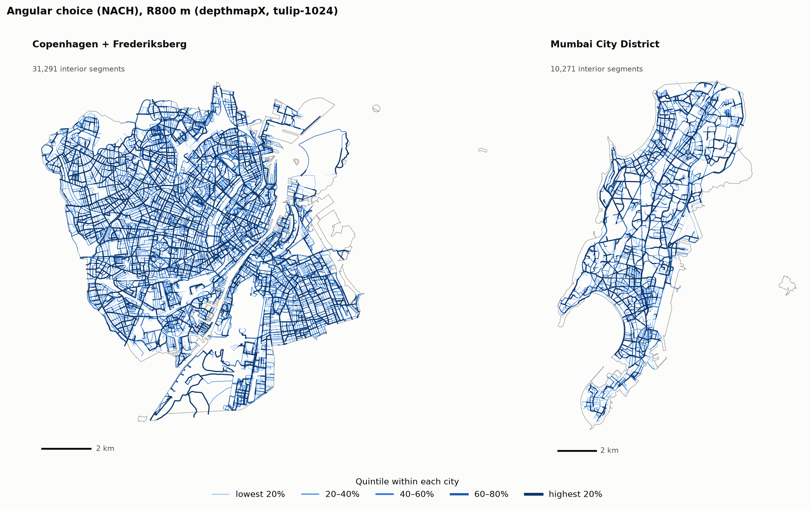
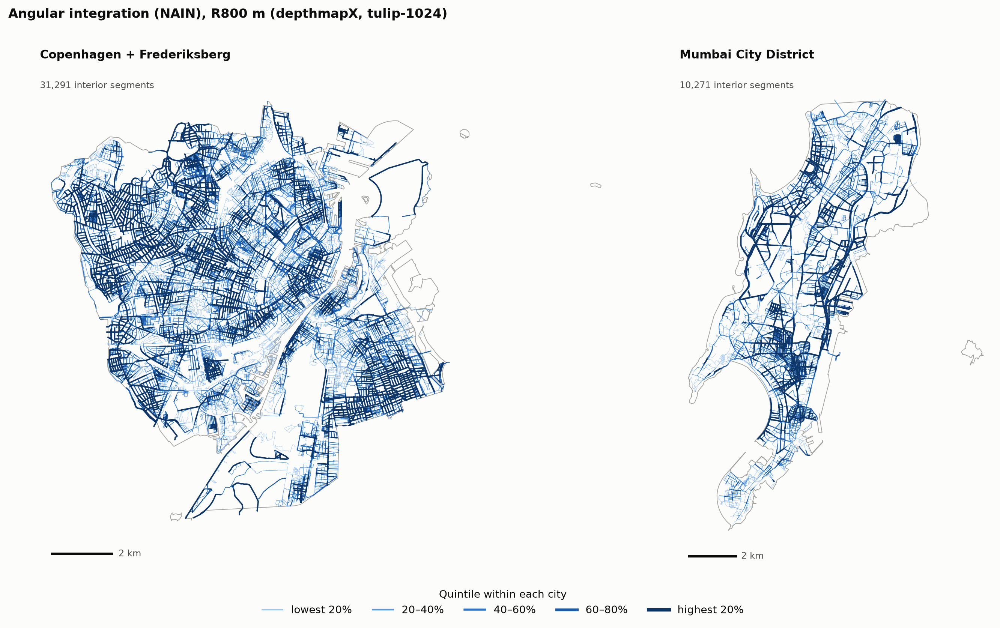
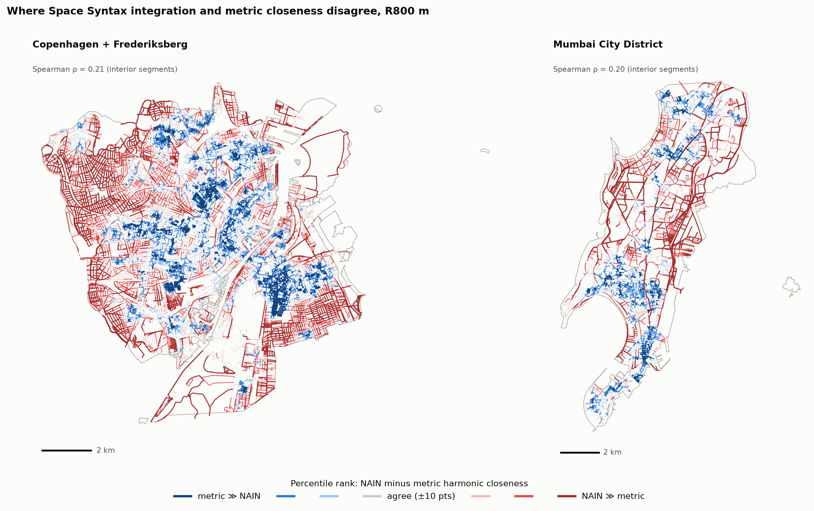

# Phase 0 — Space Syntax decomposed: Copenhagen and Mumbai

*Manish Bilore · October 2026 · code: `ss_vs_assembled` (Python)*

## Question

Space Syntax (SS) and conventional network analysis often rank the same streets differently.
Which design choices cause that: representation, distance cost, closeness formula,
normalisation, or the software engine itself? And does the answer change between a
well-mapped Nordic city and an Indian city?

## Method

**1. Learn SS by rebuilding it.** Axial and angular segment measures were reimplemented in
Python from first principles (depth, mean depth, RA, RRA with the D-value, integration,
choice, NAIN, NACH, control, intelligibility, synergy) and checked against hand-worked toy
layouts (23 tests).

**2. Check against the reference tool.** depthmapX (UCL) was built from source and run on its
own London test data (Barnsbury). Our code was fed depthmapX's exported connection lists, so any
difference is in the measure definitions.

**3. Decompose the gap.** A ladder of five rungs changes one design choice at a time, from plain
metric network centrality (S0, cityseer) to standard SS angular analysis (S3, depthmapX).
Agreement between neighbouring rungs is Spearman ρ over interior segments, at radii 400, 800,
1200 and 2000 m.

| Rung | Representation | Cost | Measure |
|---|---|---|---|
| S0 | Junctions (primal) | Metric | harmonic closeness, betweenness |
| S1 | Street segments | Metric | harmonic, NC²/TD, betweenness |
| S2 | Street segments | Angular | NC²/TD, betweenness |
| S3 | Straight pieces (depthmapX) | Angular, tulip-1024 | NC²/TD to NAIN, choice to NACH |

**Test beds:** Copenhagen + Frederiksberg (103 km²) and Mumbai City District, the island city
(71 km²). Both are water-bounded windows of similar size, with OSM walk networks and a 2 km
buffer against edge effects.

## Result 1 — fidelity: the reimplementation matches depthmapX

| Map | Measures | Agreement with depthmapX |
|---|---|---|
| Axial, 1,100 lines | depth, MD, RA, RRA, integration (HH, P-value, Tekl), control | exact (≤ 1e-7) |
| Axial | choice | identical totals; differs only on tied routes (depthmapX breaks ties at random) |
| Segment, 5,459 segments, R400–Rn | node count, total depth, integration | ≥ 99.98% of segments exact |
| Segment | choice | 99.1–100% exact once depthmapX's per-direction counting is reproduced |

Getting there exposed conventions that are rarely written down, among them:
- metric radius is measured along the least-angle route;
- ties are broken by metric distance;
- angular choice is counted per direction;
- angle binning changes catchments.

All 21 are in `docs/nuances.md`; full tables in `reports/fidelity_barnsbury.md`.

## Result 2 — the networks

| | Copenhagen | Mumbai island city |
|---|---|---|
| Interior segments | 31,291 | 10,271 |
| Network km per km² | 23.0 | **14.5** |
| Segments per km² (10 m consolidation) | 303 | 144 |
| Median segment | 62 m | 73 m |

Mumbai's buildings are far denser than Copenhagen's, but its mapped walk network is much
sparser: Copenhagen has about 1.6× the network length per km² (a ratio that is stable under
network cleaning, unlike segment counts). OSM is missing most informal and internal lanes, so the Mumbai results are
the "without informal lanes" case. Measuring that omission is Project 2.

## Result 3 — where the two approaches diverge



*Figure 1. Rank agreement at each single-change step. Dots: 800 m; bars: range over
400–2000 m. Shaded row: first rung against last.*

- **The gap is several gaps.** Angular cost, engine conventions and SS normalisation each
  reorder streets by similar amounts. End to end, metric closeness and NAIN are close to
  unrelated at 400 m in both cities (ρ ≈ 0).
- **Normalisation matters most; the closeness formula least.** Harmonic vs NC²/TD agree at
  ρ ≈ 0.98, while NC²/TD to NAIN drops to 0.44–0.53 at 400 m. The exponent on NC sets how
  much network density counts, so choosing NAIN is a substantive decision rather than a rescaling.
- **Engine disagreement has two causes.** At 10 m junction consolidation cityseer and depthmapX
  agree at only 0.67–0.90. About half of that gap comes from stubs that consolidation appends
  at merged junctions. The rest follows segment length relative to the radius: the engines
  draw the edge of a catchment differently, which matters when segments are long compared with
  the radius (Phase 1 WP2–2c). Replacing curved streets with straight chords raises NAIN/NACH
  agreement by 0.04–0.11, because depthmapX counts straight pieces rather than streets.
- **The cities differ in where divergence sits.** Metric vs angular cost changes Mumbai less
  than Copenhagen; the engine and normalisation steps change it more; end-to-end betweenness
  agreement is lower (0.39–0.52 vs 0.57–0.65).

Full tables: `reports/results_phase0.md`.

## Maps



*Figure 2. Angular choice (NACH), 800 m. Quintiles within each city; raw values are not
comparable across cities.*



*Figure 3. Angular integration (NAIN), 800 m.*



*Figure 4. NAIN percentile minus metric-closeness percentile. Red: Space Syntax ranks the
street higher. Blue: metric closeness does. Grey: within 10 percentile points.*

## Limits

- Rank agreement is not validity. Which rung tracks observed movement is the next question
  (Copenhagen counts; Dharavi gate counts in Project 2).
- Results depend on OSM tagging, junction consolidation and curve handling. Consolidation has
  been tested (Phase 1 WP2): the normalisation and end-to-end closeness results hold at 0, 10
  and 20 m; the engine and betweenness results do not.
- cityseer's angular values at one radius depend on the other radii requested in the same run.
  All tables use the 400–2000 m set.

## Reproduce

```bash
pip install -e ".[dev]" && pytest -q                       # 25 tests incl. depthmapX parity
export DEPTHMAPX=/path/to/depthmapXcli                       # docs/depthmapx_build.md
python scripts/00_fidelity.py --lines barnsbury_extended1_axial.csv --name barnsbury
python scripts/01_fetch_network.py --site copenhagen        # and --site mumbai_island
python scripts/02_ladder.py --site copenhagen --radii 400 800 1200 2000
python scripts/02_ladder.py --site copenhagen --radii 400 800 1200 2000 --s3-geometry chord --tag _chord
python scripts/03_figures.py --sites copenhagen mumbai_island --radius 800
```

## Next

- **Phase 1:** axial maps and intelligibility; scale (equal-area tiles, nested extents);
  catchment size beside every measure; cleaning sensitivity.
- **Project 2:** Dharavi lanes digitised and the informal-lane inclusion effect.
- **Project 3:** pedestrian-weighted exposure built on these movement layers.
